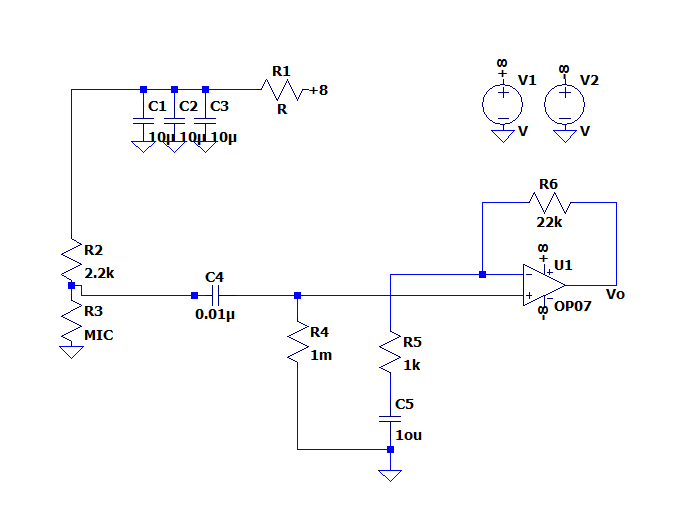

# Audio Distortion Project

**Audio Distortion** is an audio processing experiment that captures live microphone input, alters the signal's pitch, and outputs the distorted audio using a combination of custom hardware and software. The system uses a microphone circuit to capture audio, **Analog Discovery 2 (AD2)** for interfacing, and **MATLAB** for digital signal processing and playback.

---

## Features

- Pitch shifting using near-real-time MATLAB processing
- Custom microphone preamp circuit for clean signal input
- Signal visualization (waveforms and spectrograms)
- Integration with AD2 for analog input/output (via WaveForms or SDK)
- Adjustable pitch factors for experimentation

---

## Tech Stack

- **MATLAB**: Signal processing and pitch shifting
- **Analog Discovery 2** (via WaveForms): For audio acquisition and playback
- **Microphone Circuit**: Amplifies and filters audio signals
- **Op-Amps & Passive Components**: Hardware interface design

---

## Installation & Setup

1. **Hardware Setup**  
   - Connect your microphone circuit output to **AD2 AI0** (analog input)  
   - Connect **AO0** (analog output) to speaker/headphones via an amplifier  
   - Power your circuit (e.g., ±5V dual supply)

2. **MATLAB & Dependencies**  
   - MATLAB R2022+ recommended  

3. **WaveForms Setup**  
   - Use WaveForms to stream or record audio signals (optional)  
   - You can also export CSV data from WaveForms and process in MATLAB

---

## How It Works

1. Capture audio from a mic circuit via AD2 or MATLAB's audio interface  
2. MATLAB shifts the pitch using resampling or DSP  
3. Output the processed audio to speaker/headphones

---
## Pictures

*Circuit*  

